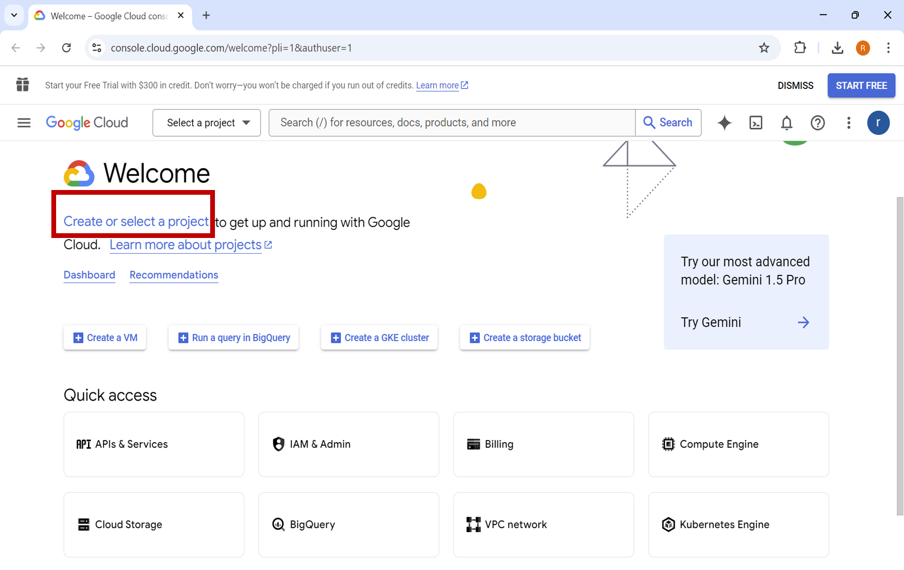
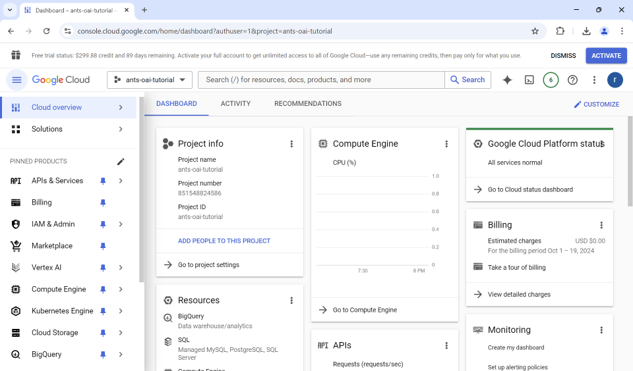
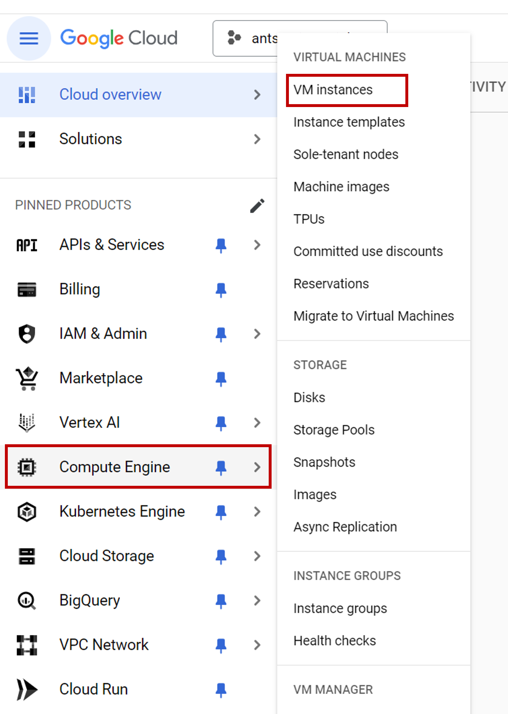
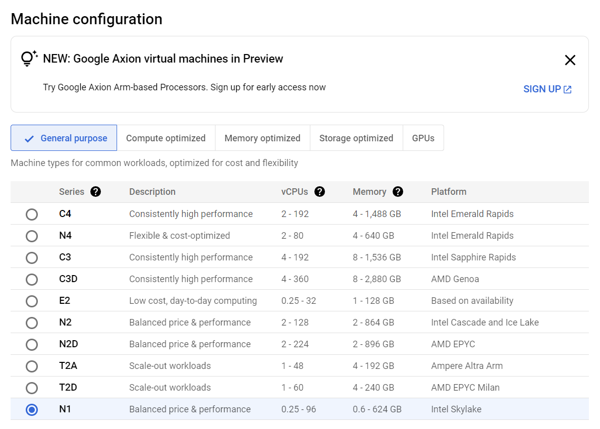
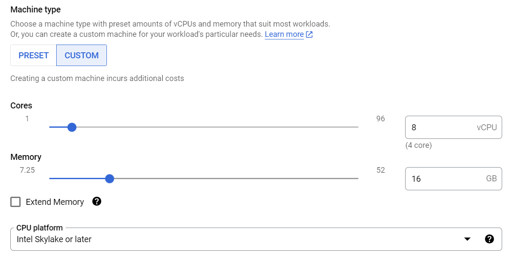
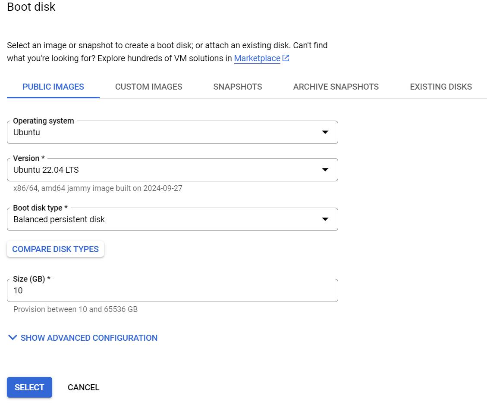
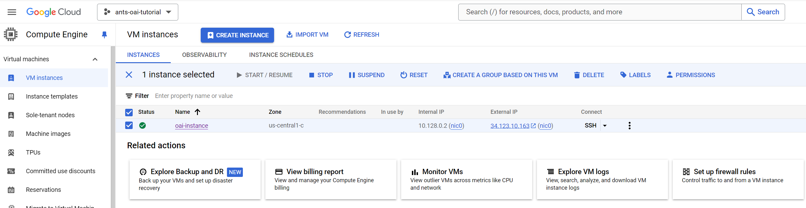

# Virtual Machine Creation in Google Cloud Platform for Running OAI

#  1. Introduction
This tutorial describes the steps in creating a virtual machine (VM) on the Google Cloud Platform (GCP). The VM can run an end-to-end 5G network based on the OpenAirInterface (OAI) software stack in RF simulator (RFsim) mode. 

## 1.1 Prerequisites
Before you begin, make sure you have access to your GCP account. If you do not have one, you can sign up with your Google account at   [https://cloud.google.com/](https://cloud.google.com)

Depending on the country you are located in, you generally have some free credits to try the GCP products. If you haven't used them already, these free credits would be enough for a few days to have a hands-on experience with OAI.

## 1.2 Minimum Computing Requirements
To run an end-to-end 5G network with OAI Core Network (CN),
Radio Access Network (RAN) including base station (gNB) and user equipment (nrUE) in RFsim mode, we should have the following minimum recommended computing requirements: 
-  Operating System: Ubuntu 22.04 LTS
-  CPU: 8 cores x86_64 @ 3.5 GHz
- RAM: 16 GB

We will now create a VM on the GCP that satisfies these requirements.

# 2. VM Creation

***Step 1:  Accessing the console and creating a project***

1.  Open your web browser and login to [https://console.cloud.google.com/](https://console.cloud.google.com/). 
2.  If you are using GCP for the first time, you will not have any projects. If you don’t have a project yet, you can create a new project and then select it. If you already have projects and are familiar with GCP you can select any of your projects.

3. After successful project creation, the project dashboard looks like this with your given project name 

  
 
***Step 2:  Creating a VM Instance***
 
1. Select the "Compute Engine" and then "VM instances" from your project dashboard.

2. Click on the "CREATE INSTANCE" button to create a new VM instance
3. Enter a name to your VM instance and then choose the region. Preferably select a region closest to yours for better performance.

4. Choose "General purpose" Machine Configuration. OAI is reliably tested on x86 architecture and requires Advanced Vector Extensions (AVX2) instructions. The AVX2 instructions are supported by starting from Intel Haswell platforms. Therefore choose a "series" that respects these constraints. An example tested configuration is shown in the figure below
 
 

5. USe the "CUSTOM" option to set your machine type. We require at least 8vCPU cores (4 physical cores) and 16 GB of RAM.  The AVX2 instructions are supported by starting from Intel Haswell platforms. Therefore choose the option in "CPU platform" under "ADVANCED CONFIGURATION" accordingly. An example tested configuration is shown in the figure below.

6. For screen capturing and recording you can enable the "Display device" option

7. Click on the "CHANGE" button under the "Boot disk" menu and choose the ***x86/64 Ubuntu 22.04 LTS*** operating system. Double-check that you have chosen the right option.

8. In the "Firewall" enable HTTP and HTTPs traffic and in "Advanced options->Networking" enable the "IP forwarding" 

9. Hit the "CREATE" button to finish the VM creation

10. If you have successfully performed all the above steps, in your project dashboard you can see the VM instance you have just created
 

11. Connect to your VM via SSH client

12. To check if you have a correct Ubuntu version type `uname -a`. You should see the output string has 22.04 and x86_64. If not, the installation is not correct.

13. To check if you have `avx2` instruction set, type `lscpu | grep avx2`. If `avx2` is not visible, then the installation is not correct.

14. To stop the VM temporarily, from the "Compute Engine" dashboard select your VM and click on the "Stop" button. You can click on "START/RESUME" to use the VM again. It is preferable to stop the VM when not using it.

15. If you click on the “Delete” button, however, the VM will be deleted and all data will be lost. If you have accidentally pressed "Delete" then you have to redo all the above steps to make a VM instance.
    

